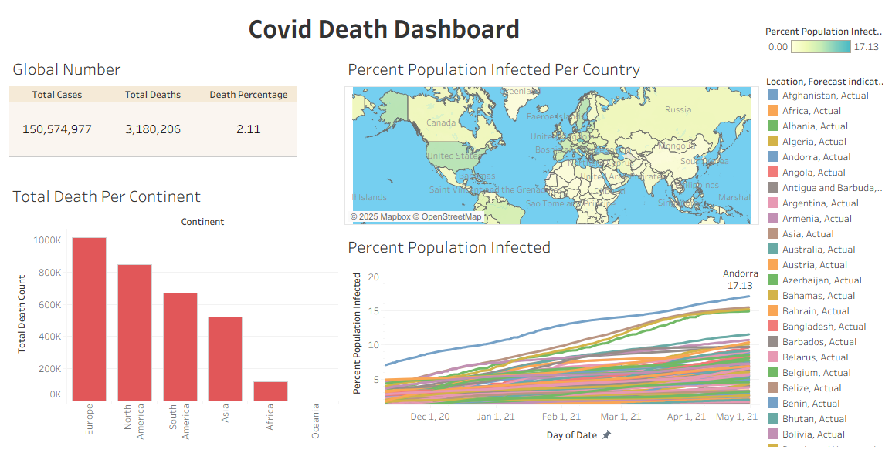

# Portofolio Project - Covid Cases 

## 🌍 Project Overview

Project ini merupakan project yang berasal dari series Data Analyst Portofolio Project pada platform Youtube. Dimana, project ini terdiri atas Project SQL Exploration ([Part 1](https://www.youtube.com/watch?v=qfyynHBFOsM)) dan Project Data Visualization dengan Tableau ([Part 2](https://www.youtube.com/watch?v=QILNlRvJlfQ)).

## 📝 SQL Exploration 

### - Dataset 
Data yang digunakan merupakan dataset Covid 2020 yang dapat dikunjungi pada source berikut ini [Source Data](https://ourworldindata.org/covid-deaths). Namun, dikarenakan ada perubahan dalam website tersebut, sehingga data yang nantinya akan digunakan dapat diperoleh dari link berikut ini: [CovidDeath](https://github.com/AlexTheAnalyst/PortfolioProjects/blob/main/CovidDeaths.xlsx) dan [CovidVaccination](https://github.com/AlexTheAnalyst/PortfolioProjects/blob/main/CovidVaccinations.xlsx). 

### - Case 
Case ini merupakan beberapa pertanyaan atau kondisi yang ingin dilihat melalui data yang dimiliki. Dalam SQL Exploration ini ada beberapa case yang diselesaikan, diantaranya: 

1. Total Cases vs Total Deaths
2. Total Cases VS Population
3. Persentase Kematian secara Global
4. Total Population VS Vaccinations (JOIN CASE)

## 📊 Data Visualization with Tableau 

### Dashboard 

### Dataset 
Data yang digunakan dalam project visualisasi dengan Tableau ini masih menggunakan Data CovidDeaths dengan beberapa kondisi yang dilihat dari data yang ada, yakni: 
1. Global Numbers (Melihat total cases, total death, serta percentase kematian dari perhitungan jumlah kasus kematian baru dibandingkan dengan jumlah terkini orang yang terinfeksi).
2. Total Deaths Per Continent (Melihat total kasus kematian dari setiap benua).
3. Percent Population Infected Per Country (Dihasilkan dari perhitungan perbandingan antara Total Cases disuatu dengan dengan Populasi warga negara tersebut).
4. Percent Population Infected (Time Series). 

Source code untuk case data yang dituliskan diatas dapat diakses link berikut [SQL For Tableau Viz](https://github.com/AlexTheAnalyst/PortfolioProjects/blob/main/Tableau%20Portfolio%20Project%20SQL%20Queries.sql), kemudian dari hasil data yang dijalankan (run) dapat diexport ke dalam format .xsls atau .csv untuk nantinya dapat diupload ke dalam Tableau. 

